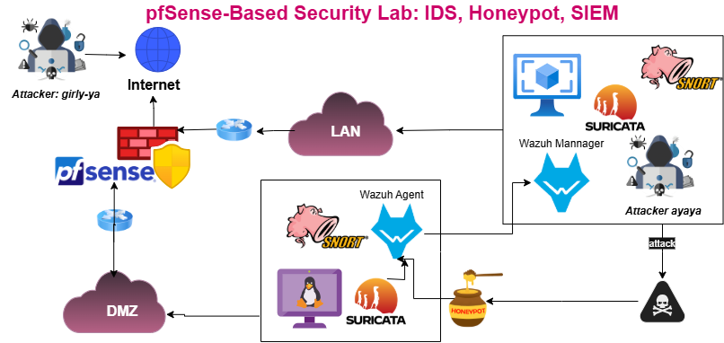

# Cybersecurity-Lab-pfSense-Wazuh-Honeypot
A simulated enterprise network lab with pfSense, Wazuh SIEM, Cowrie honeypot, and Suricata IDS for security monitoring and detection.

---

##  Overview

I’ve built a complete network security lab from scratch, simulating a real-world enterprise environment with **LAN**, **DMZ**, and **WAN** zones, all connected and protected using **pfSense** as the firewall and router.

This lab was designed to simulate threat detection, centralized logging, and real-time monitoring workflows — just like in real organizations.

---

## Architecture

The lab consists of the following components:

- **pfSense**: Manages network segmentation and firewall rules across LAN, DMZ, and WAN
- **Kali Linux (LAN)**: 
  - Acts as the **attacker machine**
  - Hosts the **Wazuh Manager** (SIEM)
  - Runs **Suricata IDS** for LAN traffic monitoring
- **Ubuntu Server (DMZ)**: Hosts:
  - Wazuh Agent
  -  Suricata IDS
  -  Cowrie Honeypot (SSH)

All logs from Suricata (LAN & DMZ) and Cowrie honeypot are forwarded to **Wazuh Manager running on Kali**, where they are **correlated and visualized**.
## Network Architecture Diagram



---

##  Tools Used

- **pfSense** – Firewall and router
- **Wazuh** – SIEM for log correlation and visualization
- **Suricata** – IDS/IPS for deep packet inspection
- **Cowrie** – Honeypot to simulate SSH access
- **Kali Linux** – Attack machine (LAN)
- **Ubuntu Server** – Hosts DMZ components (Suricata, Cowrie, Wazuh Agent)
- **VirtualBox** – Virtualization platform
- **SSH, JSON logging, Snort**

---

## Project Goals

-  Simulate real-world threat detection and network segmentation
-  Understand how IDS, honeypots, and SIEM work together
-  Forward logs from multiple sources to a central platform
-  Visualize and analyze attacks (especially SSH attacks on Cowrie)

---

## Repository Structure

```bash
network-security-lab/
│
├── README.md                   # Project documentation
├── diagrams/                   # Network architecture diagram(s)
│   └── diagram.drawio.png
├── setup/                      # Step-by-step guides
│   ├── pfsense-setup.md
│   ├── wazuh-manager-setup.md
    ├── wazuh-agent-setup.md
│   ├── cowrie-setup.md
│   ├── suricata-setup.md
├── screenshots/                # Dashboards and CLI views (optional)
├── logs-and-alerts/            # Sample Wazuh alerts and Cowrie logs (optional)
